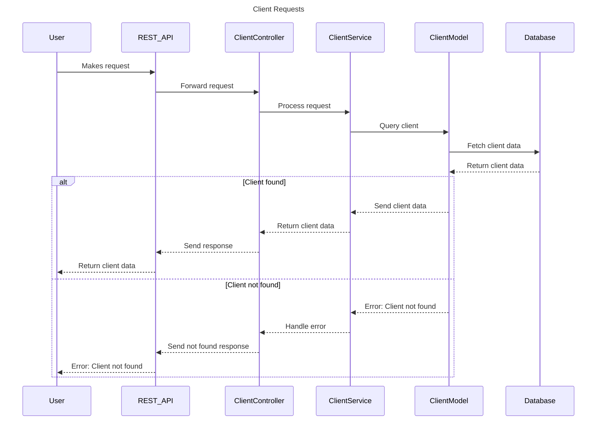
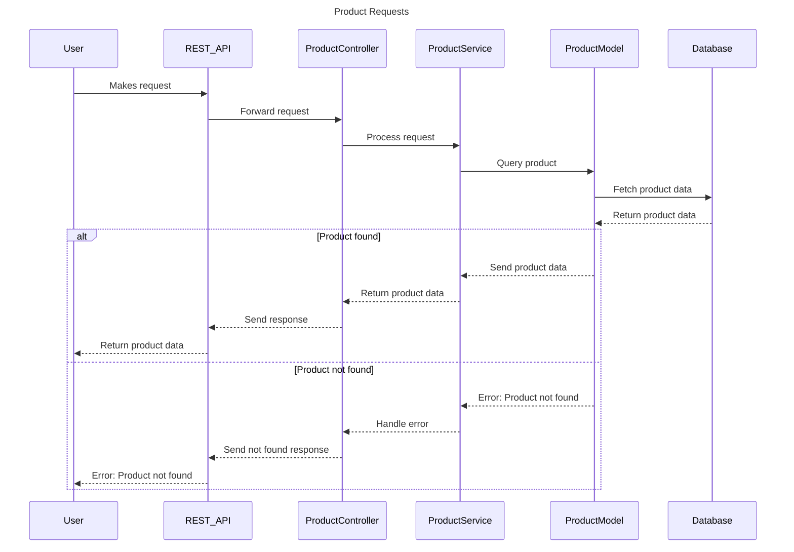
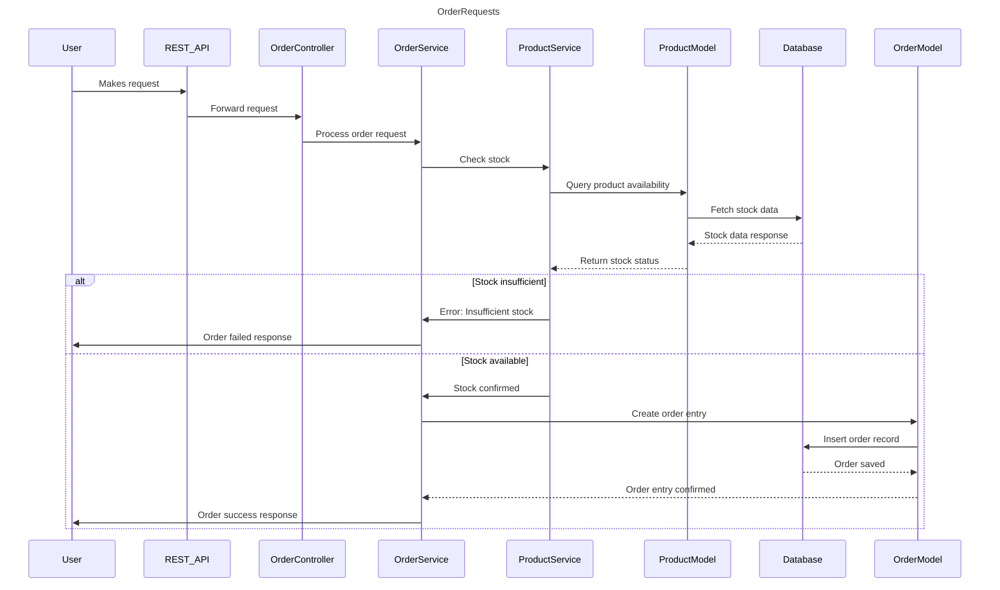

```mermaid
sequenceDiagram
    title Client Requests
    User->>REST_API: Makes request
    REST_API->>ClientController: Forward request
    ClientController->>ClientService: Process request
    ClientService->>ClientModel: Query client
    ClientModel->>Database: Fetch client data
    Database-->>ClientModel: Return client data

    alt Client found
        ClientModel-->>ClientService: Send client data
        ClientService-->>ClientController: Return client data
        ClientController-->>REST_API: Send response
        REST_API-->>User: Return client data
    else Client not found
        ClientModel-->>ClientService: Error: Client not found
        ClientService-->>ClientController: Handle error
        ClientController-->>REST_API: Send not found response
        REST_API-->>User: Error: Client not found
    end
```

```mermaid
sequenceDiagram
    title Product Requests
    User->>REST_API: Makes request
    REST_API->>ProductController: Forward request
    ProductController->>ProductService: Process request
    ProductService->>ProductModel: Query product
    ProductModel->>Database: Fetch product data
    Database-->>ProductModel: Return product data

    alt Product found
        ProductModel-->>ProductService: Send product data
        ProductService-->>ProductController: Return product data
        ProductController-->>REST_API: Send response
        REST_API-->>User: Return product data
    else Product not found
        ProductModel-->>ProductService: Error: Product not found
        ProductService-->>ProductController: Handle error
        ProductController-->>REST_API: Send not found response
        REST_API-->>User: Error: Product not found
    end
```

```mermaid
sequenceDiagram
    title OrderRequests
    User->>REST_API: Makes request
    REST_API->>OrderController: Forward request
    OrderController->>OrderService: Process order request
    OrderService->>ProductService: Check stock
    ProductService->>ProductModel: Query product availability
    ProductModel->>Database: Fetch stock data
    Database-->>ProductModel: Stock data response
    ProductModel-->>ProductService: Return stock status

    alt Stock insufficient
        ProductService->>OrderService: Error: Insufficient stock
        OrderService->>User: Order failed response
    else Stock available
        ProductService->>OrderService: Stock confirmed
        OrderService->>OrderModel: Create order entry
        OrderModel->>Database: Insert order record
        Database-->>OrderModel: Order saved
        OrderModel-->>OrderService: Order entry confirmed
        OrderService->>User: Order success response
    end
```
