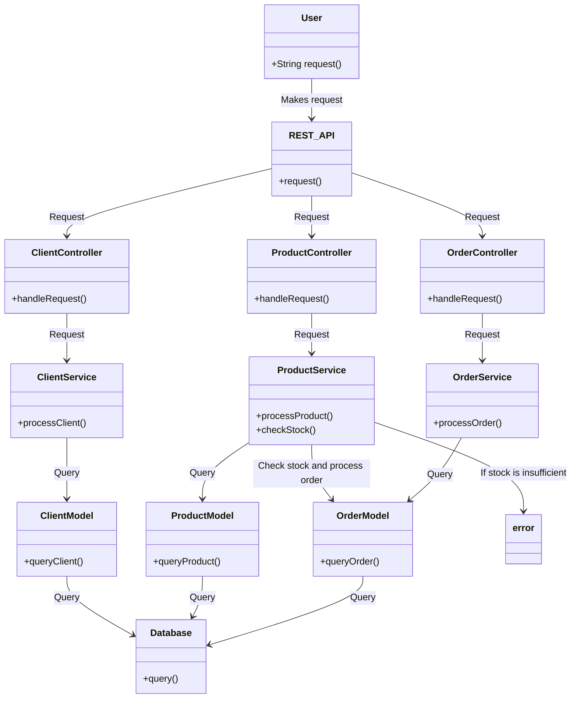
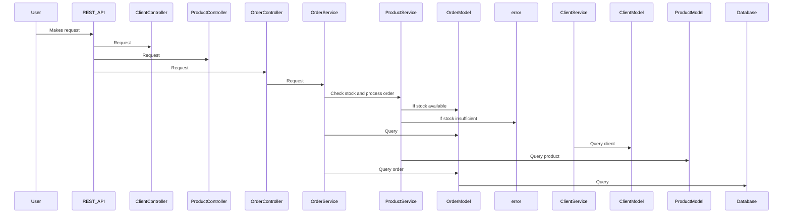

```mermaid
classDiagram
class User {
+String request()
}

    class REST_API {
        +request()
    }

    class ClientController {
        +handleRequest()
    }

    class ProductController {
        +handleRequest()
    }

    class OrderController {
        +handleRequest()
    }

    class ClientService {
        +processClient()
    }

    class ProductService {
        +processProduct()
        +checkStock()
    }

    class OrderService {
        +processOrder()
    }

    class ClientModel {
        +queryClient()
    }

    class ProductModel {
        +queryProduct()
    }

    class OrderModel {
        +queryOrder()
    }

    class Database {
        +query()
    }

    User --> REST_API : Makes request
    REST_API --> ClientController : Request
    REST_API --> ProductController : Request
    REST_API --> OrderController : Request
    ClientController --> ClientService : Request
    ProductController --> ProductService : Request
    OrderController --> OrderService : Request
    ProductService --> OrderModel : Check stock and process order
    ProductService --> error : If stock is insufficient
    ClientService --> ClientModel : Query
    ProductService --> ProductModel : Query
    OrderService --> OrderModel : Query
    ClientModel --> Database : Query
    ProductModel --> Database : Query
    OrderModel --> Database : Query
```

```mermaid
sequenceDiagram
    User->>REST_API: Makes request
    REST_API->>ClientController: Request
    REST_API->>ProductController: Request
    REST_API->>OrderController: Request
    OrderController->>OrderService: Request
    OrderService->>ProductService: Check stock and process order
    ProductService->>OrderModel: If stock available
    ProductService->>error: If stock insufficient
    OrderService->>OrderModel: Query
    ClientService->>ClientModel: Query client
    ProductService->>ProductModel: Query product
    OrderService->>OrderModel: Query order
    OrderModel->>Database: Query
```
